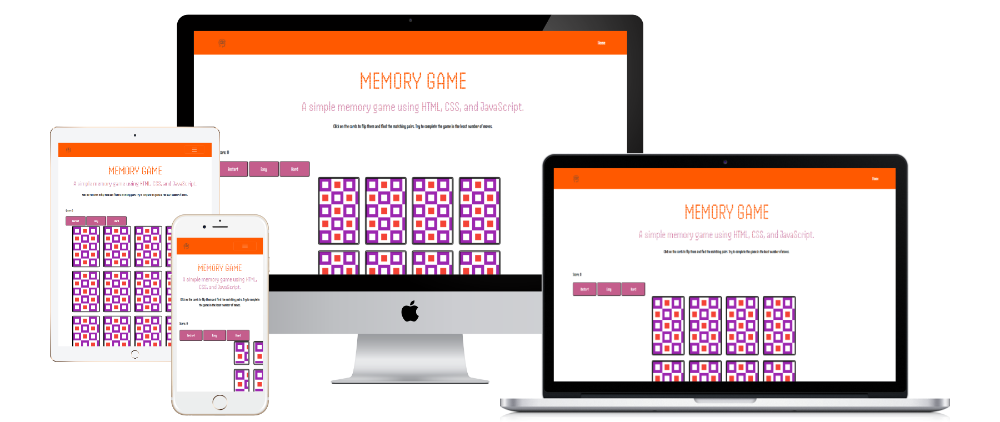
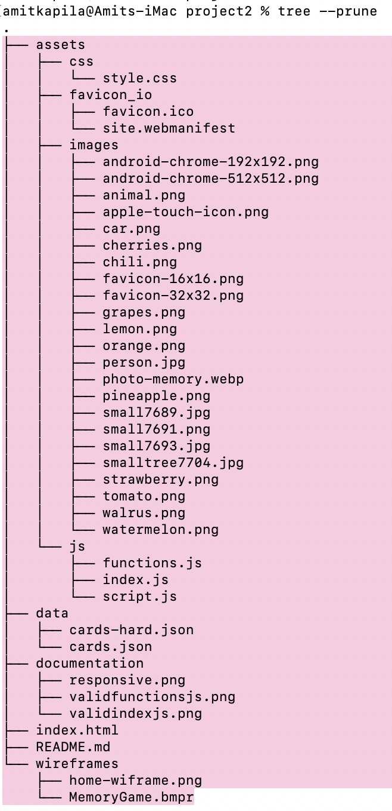
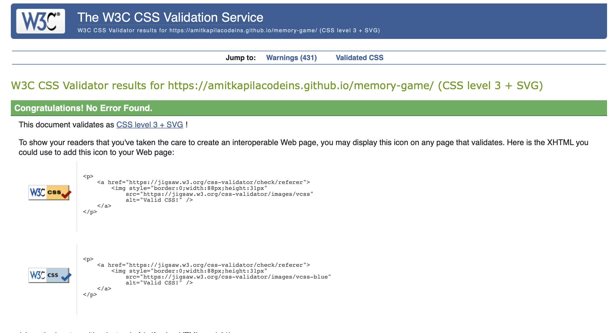
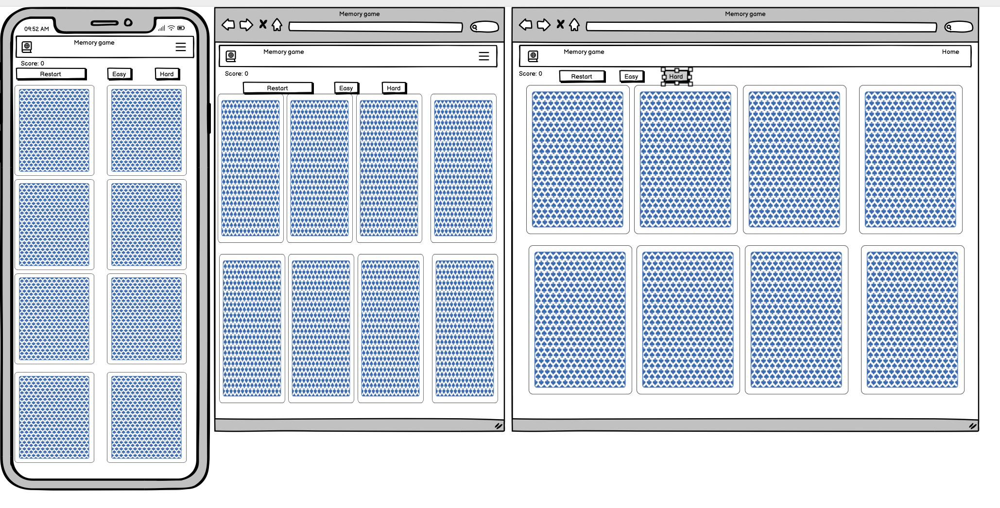

<!-- START doctoc generated TOC please keep comment here to allow auto update -->
<!-- DON'T EDIT THIS SECTION, INSTEAD RE-RUN doctoc TO UPDATE -->

- [Memory game](#memory-game)
  - [Planning](#planning)
  - [Requirements](#requirements)
  - [User Stories](#user-stories)
      - [As a First-Time Visitor, I need easy navigation and a user-friendly design, including a responsive layout for my device.](#as-a-first-time-visitor-i-need-easy-navigation-and-a-user-friendly-design-including-a-responsive-layout-for-my-device)
      - [As a player, I want to see clear instructions on how to play, so I am clear on what I need to do in order to win.](#as-a-player-i-want-to-see-clear-instructions-on-how-to-play-so-i-am-clear-on-what-i-need-to-do-in-order-to-win)
      - [As a player, I want to see revealed cards that allows me to keep track.](#as-a-player-i-want-to-see-revealed-cards-that-allows-me-to-keep-track)
      - [As a player, I want the hidden cards to change each time the game starts.](#as-a-player-i-want-the-hidden-cards-to-change-each-time-the-game-starts)
      - [As a player, I want to be see my score so that I have a target that I aim to beat in subsequent goes.](#as-a-player-i-want-to-be-see-my-score-so-that-i-have-a-target-that-i-aim-to-beat-in-subsequent-goes)
  - [Features](#features)
      - [All pages on the website have](#all-pages-on-the-website-have)
  - [Code](#code)
      - [Files](#files)
      - [Code format](#code-format)
      - [Code understandability](#code-understandability)
  - [Testing](#testing)
      - [Manual Testing](#manual-testing)
      - [Accessibility](#accessibility)
      - [HTML](#html)
      - [CSS](#css)
  - [Bugs](#bugs)
    - [Unfixed Bugs](#unfixed-bugs)
  - [Deployment](#deployment)
    - [Version Control](#version-control)
  - [Wireframes](#wireframes)
  - [Credits](#credits)

<!-- END doctoc generated TOC please keep comment here to allow auto update -->

# Memory game

## Planning

-   The site owner's goal is to create a fun and engaging game.

## Requirements

-   The site owner wants players to enjoy the challenge. With that in mind the game should be visually appealing. The cards should look good with interesting effects upon selection as well as sound cues.

-   The site should be responsive, adapting to all screen sizes.

-   Players should be allowed to challenge their memory skills with different levels as they build up confidence. They should be congratulated with a rewarding pop up notification.



---

## User Stories

#### As a First-Time Visitor, I need easy navigation and a user-friendly design, including a responsive layout for my device.

-   The site applies responsive design principles using Bootstrap to ensure the website is accessible on various devices.
-   The site layout and navigation are based on best practices, ensuring all key sections and pages are easily accessible.

#### As a player, I want to see clear instructions on how to play, so I am clear on what I need to do in order to win.

-   The site has clear instructions that guide the user through basic actions.

#### As a player, I want to see revealed cards that allows me to keep track.

-   Pairs of matching cards should be flipped while the game is in progress.

#### As a player, I want the hidden cards to change each time the game starts.

-   The game should shuffle the cards at the start of each game.
-   That way the game is not predictable.

#### As a player, I want to be see my score so that I have a target that I aim to beat in subsequent goes.

-   A record of how many attempts were made until all cards are revealed.
-   I want to beat this score.

---

## Features

The game has different levels. In easy mode there are 4 cards. In normal mode there are 8. In hard mode there are 16.

#### All pages on the website have

-   Clear Navigation: Easily navigate through different sections of the website.
-   Responsive Design: The site adapts gracefully to various screen sizes, ensuring optimal usability whether you're browsing on a desktop, tablet, or mobile device. I used media queries for the different screen sizes.
-   The game handles errors for.....

---

## Code

#### Files

-   Files are grouped in directories by file type
-   

#### Code format

-   VS code automatically indents HTML, Javascript and CSS to ease readability

```

const rowContainer = document.querySelector("main>.container>.row");

let cards = [];
let firstCard, secondCard;
let lockBoard = false;
let score = 0;

document.querySelector(".score").textContent = score;
restart();

function easy() {
    rowContainer.innerHTML = "";
    fetch("./data/cards.json") //Fetching the cards data from a local JSON file
        .then((response) => response.json()) //Parsing the JSON data
        .then((data) => {
            //Using the data to create the cards
            cards = [...data, ...data]; // spread operator to duplicate the array
            shuffleCards();
            generateCards();
        });
}

```

#### Code understandability

-   Copious amounts of comments to explain what the code is doing and why.

```
function hard() {
    rowContainer.innerHTML = "";
    fetch("./data/cards-hard.json") //Fetching the cards data from a local JSON file
        .then((response) => response.json()) //Parsing the JSON data
        .then((data) => {
            //Using the data to create the cards
            cards = [...data, ...data]; // spread operator to duplicate the array
            shuffleCards();
            generateCards();
        });
}
```

---

## Testing

#### Manual Testing

| Feature                      | Action                       | Expected result                                | Tested | Passed | Comments                                                                                                                  |
| ---------------------------- | ---------------------------- | ---------------------------------------------- | ------ | ------ | ------------------------------------------------------------------------------------------------------------------------- |
| Navbar                       |                              |                                                |        |        |                                                                                                                           |
| Home                         | Click on the "Home" link     | The user is redirected to the main page        | Yes    | Yes    | \-                                                                                                                        |
| Services                     | Click on the "Services" link | The user is redirected to the Services section | Yes    | Yes    | \-                                                                                                                        |
| Events                       | Click on the "Events" link   | The user is redirected to the Events section   | Yes    | Yes    | \-                                                                                                                        |
| Coaching                     | Click on the "Coaching" link | The user is redirected to the Coaching page    | Yes    | Yes    | \-                                                                                                                        |
| Contact                      | Click on the "Contact" link  | The user redirected to the Contact section     | Yes    | Yes    | \-                                                                                                                        |
| Become a member              | Click "Become a member" link | The user redirected to the Membership page     | Yes    | Yes    | \-                                                                                                                        |
| Footer                       |                              |                                                |        |        |                                                                                                                           |
| Instagram icon in the footer | Click on the Instagram icon  | The user is redirected to the Instagram page   | Yes    | Yes    | \-                                                                                                                        |
| Facebook icon in the footer  | Click on the Facebook icon   | The user is redirected to the Facebook page    | Yes    | Yes    | \-                                                                                                                        |
| X icon in the footer         | Click on the X icon          | The user is redirected to the X page           | Yes    | Yes    | \-                                                                                                                        |
| " Home page"                 |                              |                                                |        |        |                                                                                                                           |
| Logo                         | Click on the "Logo" link     | The user is redirected to the main page        | Yes    | Yes    | \-                                                                                                                        |
| Membership page              |                              |                                                |        |        |                                                                                                                           |
| Name input                   | Enter Name                   | Name is entered                                | Yes    | Yes    | If the user doesn't enter name, the error message appears                                                                 |
| Email input                  | Enter the email              | The email is entered                           | Yes    | Yes    | If the user doesn't enter the email, the error message appears. If user enters not valid email, the error message appears |
| Phone number input           | Enter the phone number       | The phone number is entered                    | Yes    | Yes    | If the user doesn't enter the number, the error message appears. If user enters an invalid number, input doesn't appear   |
| Age input                    | Enter the age                | The age number is entered                      | Yes    | Yes    | If the user doesn't enter the age, the error message appears. If user enters an invalid number, input doesn't appear      |
| Message input                | Enter message                | Message is entered                             | Yes    | Yes    | If the user doesn't enter a message, the error message appears.                                                           |
| "Submit" button              | Click on the "Submit" button | The user is redirected to the response page    | Yes    | Yes    | \-                                                                                                                        |
|                              |                              |                                                |        |

#### Accessibility

-   I used Lighthouse within the Chrome Developer Tools to allow me to test the performance, accessibility, best practices and SEO of the website. I confirmed that the colours and fonts are easy to read and that the site is accessible.

#### HTML

-   [HTML Validator](https://validator.w3.org/#validate_by_upload) was run on each page of the project. A syntax error was found in the footer of all 4 pages.

#### CSS

-   [Vendor prefixes](https://autoprefixer.github.io/) Used Autoprefixer to parse the CSS and add vendor prefixes.
-   [CSS Validator](https://validator.w3.org/#validate_by_upload) some syntax errors were identified.
    
-   These were fixed.
    

---

## Bugs

-   On smaller screens, the navbar did not close when clicking on links to sections on the same page.
    
-   Fixed by adding javaScript to ensure the navbar closes when clicking internal links

---

### Unfixed Bugs

All bugs identified were fixed

## Deployment

### Version Control

-   The site was created using VS Code as IDE and pushed to Github to the remote repository 'tennis-club'.
-   Git commands were employed extensively during development to push the code to the remote repository. The sequence of Git commands utilized includes:
    -   **git add .**: This command adds the files to the staging area, preparing them for commitment.
    -   **git commit -m "commit message"**: It commits the changes to the local repository queue, marking them as ready for the final step.
    -   **git push**: This command is executed to push all committed code to the remote repository on Github.
    ### Deployment to Github pages
    The site was deployed to GitHub pages. The steps taken to deploy are as follows:
    1. Log in to [Github](https://github.com/);
    2. Navigate to [AmitKapilaCodeIns/tennis-club](https://github.com/AmitKapilaCodeIns/tennis-club) in the list of repositories;
    3. In the GitHub repository, navigate to the Settings tab;
    4. In Settings scroll down to GitHub pages which opens in a new page;
    5. From the source section drop-down menu, select the Master Branch;
    6. Once the master branch has been selected, the page is automatically refreshed and a display indicates the successful deployment and the link to the address.
       The live link can be accessed here: [Richings Tennis](https://amitkapilacodeins.github.io/tennis-club/index.html)
    ### Cloning Repository Code locally
    -   To clone the repository code locally, follow these steps:
    1. Navigate to the Github repository you wish to clone;
    2. Click on the "Code" button located above all the project files;
    3. Select "HTTPS" and copy the repository link;
    4. Open the IDE of your choice and paste the copied git URL into the IDE terminal;
    5. Press Enter to execute the command;
    6. The project will now be created as a local clone in your IDE.

---

## Wireframes

-   These wireframes were created using Balsamiq during the Scope Plane part of the design and planning process for this project. The site was developed with the Desktop layout method first. The wireframes were therefore drawn with that thought in mind and adapted alongside project changes, and created with [Balsamiq](https://balsamiq.cloud/) . First picture: Home page.
    

---

## Credits

-   I would like to extend a special thanks to my tutor [Spencer Barriball](https://www.linkedin.com/in/spencerbarriball/), whose guidance and support have been invaluable throughout this journey.
    ### Content
-   The icons in the footer and in the headings were taken from:[Font Awesome](https://fontawesome.com/).

    ### Media

-   All the images in each page of the site: Home, Services and Member was taken from: [Pexels](https://www.pexels.com/).
-   The video in the home page was also taken from [Pexels](https://www.pexels.com/).
-   For a better performance of the website, the images were resized and the format changed to WEBP using the [Birme](https://www.birme.net/) website.

[def]: .documentation/checkmylinks.png
