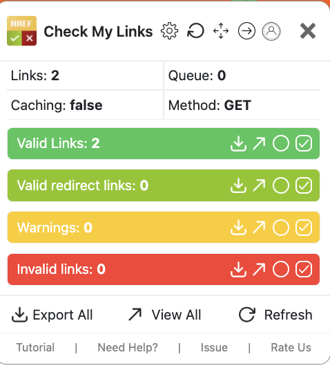

<!-- START doctoc generated TOC please keep comment here to allow auto update -->
<!-- DON'T EDIT THIS SECTION, INSTEAD RE-RUN doctoc TO UPDATE -->

- [Memory game](#memory-game)
  - [Planning](#planning)
  - [Requirements](#requirements)
  - [User Stories](#user-stories)
      - [As a First-Time Visitor, I need easy navigation and a user-friendly design, including a responsive layout for my device.](#as-a-first-time-visitor-i-need-easy-navigation-and-a-user-friendly-design-including-a-responsive-layout-for-my-device)
      - [As a player, I want to see clear instructions on how to play, so I am clear on what I need to do in order to win.](#as-a-player-i-want-to-see-clear-instructions-on-how-to-play-so-i-am-clear-on-what-i-need-to-do-in-order-to-win)
      - [As a player, I want to see revealed cards that allows me to keep track.](#as-a-player-i-want-to-see-revealed-cards-that-allows-me-to-keep-track)
      - [As a player, I want the hidden cards to change each time the game starts.](#as-a-player-i-want-the-hidden-cards-to-change-each-time-the-game-starts)
      - [As a player, I want to be see my score so that I have a target that I aim to beat in subsequent goes.](#as-a-player-i-want-to-be-see-my-score-so-that-i-have-a-target-that-i-aim-to-beat-in-subsequent-goes)
  - [Features](#features)
  - [Code](#code)
      - [Files](#files)
      - [Code format](#code-format)
      - [Code understandability](#code-understandability)
      - [Code validation](#code-validation)
  - [Testing](#testing)
      - [Manual Testing](#manual-testing)
      - [Differences Between Manual and Automated Testing](#differences-between-manual-and-automated-testing)
      - [Console](#console)
      - [Accessibility](#accessibility)
      - [HTML](#html)
      - [CSS](#css)
  - [Bugs](#bugs)
    - [Unfixed Bugs](#unfixed-bugs)
  - [Deployment](#deployment)
    - [Version Control](#version-control)
  - [Wireframes](#wireframes)
  - [Credits](#credits)

<!-- END doctoc generated TOC please keep comment here to allow auto update -->

# Memory game

## Planning

-   The site owner's goal is to create a fun and engaging game.

## Requirements

-   The site owner wants players to enjoy the challenge. With that in mind the game should be visually appealing. The cards should look good with interesting effects upon selection as well as sound cues.

-   The site should be responsive, adapting to all screen sizes.

-   Players should be allowed to challenge their memory skills with different levels as they build up confidence.


---

## User Stories

#### As a First-Time Visitor, I need easy navigation and a user-friendly design, including a responsive layout for my device.

-   The site applies responsive design principles using Bootstrap to ensure the website is accessible on various devices.
-   The site layout and navigation are based on best practices, ensuring all key sections and pages are easily accessible.

#### As a player, I want to see clear instructions on how to play, so I am clear on what I need to do in order to win.

-   The site has clear instructions that guide the user through basic actions.

#### As a player, I want to see revealed cards that allows me to keep track.

-   Pairs of matching cards should be flipped while the game is in progress.

#### As a player, I want the hidden cards to change each time the game starts.

-   The game should shuffle the cards at the start of each game.
-   That way the game is not predictable.

#### As a player, I want to be see my score so that I have a target that I aim to beat in subsequent goes.

-   A record of how many attempts were made until all cards are revealed.
-   I want to beat this score.

---

## Features

The game has different levels. In easy mode the cards are colourful and different. In medium mode the cards are more monochrome. A player clicks on the cards to flip them and find the matching pairs. Their goal is to match each card with its pair in the least number of moves. The game is simple. A pair of cards will flip for 1.5 seconds giving the player the chance to remember the image and where it is in the grid.
The restart will restart the easy game only. For the easy game the images are easier to remember. The medium game is more difficult as some images are monochrome and similarly shaped. Monochrome images are often harder to remember because color provides an additional "tag" of data, helping the brain process and store visual information more efficiently. The hard game's images are different times on the same clock face. This brings in an additional level of difficulty as the player would have to remember the time on the image.

-   Clear Navigation: Easily navigate through different sections of the website.
-   Responsive Design: The site adapts gracefully to various screen sizes, ensuring optimal usability whether you're browsing on a desktop, tablet, or mobile device. I used media queries for the different screen sizes.

---

## Code

#### Files

-   Files are grouped in directories by file type
-   

#### Code format

-   VS code automatically indents HTML, Javascript and CSS to ease readability.

```

const rowContainer = document.querySelector("main>.container>.row");

let cards = [];
let firstCard, secondCard;
let lockBoard = false;
let score = 0;

document.querySelector(".score").textContent = score;
restart();

function easy() {
    rowContainer.innerHTML = "";
    fetch("./data/cards.json") //Fetching the cards data from a local JSON file
        .then((response) => response.json()) //Parsing the JSON data
        .then((data) => {
            //Using the data to create the cards
            cards = [...data, ...data]; // spread operator to duplicate the array
            shuffleCards();
            generateCards();
        });
}

```

#### Code understandability

-   Copious amounts of comments to explain what the code is doing and why.

```
/**
 * Shuffles an array of cards using the Fisher-Yates algorithm.
 * This function modifies the array in place to randomize the order of its elements.
 * https://stackoverflow.com/questions/2450954/how-to-randomize-shuffle-a-javascript-array
 * @returns {void}
 */
function shuffleCards() {
    let currentIndex = cards.length,
        randomIndex,
        temporaryValue;
    // While there remain elements to shuffle...
    while (currentIndex !== 0) {
        // Pick a remaining element...
        let randomIndex = Math.floor(Math.random() * currentIndex);
        currentIndex--;
        // And swap it with the current element.
        [cards[currentIndex], cards[randomIndex]] = [
            cards[randomIndex],
            cards[currentIndex],
        ];
    }
}

/**
 * Generates card elements dynamically based on the `cards` array and appends them to the grid container.
 * Each card element is created with a front and back side, and an event listener is added to handle the flip action.
 *
 * @returns {void}
 */
function generateCards() {
    for (let card of cards) {
        const cardElement = document.createElement("div");
        cardElement.classList.add("card");

        cardElement.setAttribute("data-name", card.name);
        cardElement.innerHTML = `
        <div class="front">
        
        </div>
        <div class="back"></div>`;

        rowContainer.appendChild(cardElement);
        cardElement.addEventListener("click", flipCard);
    }
}
```

#### Code validation

-   JSHint passed as it only showed ES6 warnings.

-   
-   

---

## Testing

#### Manual Testing

-   In addition to automated testing, this project has also been manually tested to ensure everything works as expected. Here are the steps for manual testing:

Open the game in a web browser. Select a difficulty level, between Easy and Hard. Flip over two cards. If they match, they should stay face up. If they don't match, they should be flipped back over after a short delay. Continue flipping over cards until all pairs have been matched. The game should then display a score indicating how many turns it took to win. Test the game in different browsers and on different devices to ensure it works correctly in all environments.

| Feature          | Action                    | Expected result                           | Tested | Passed | Comments |
| ---------------- | ------------------------- | ----------------------------------------- | ------ | ------ | -------- |
| Home             | Click on the "Home" link  | The user is redirected to the main page   | Yes    | Yes    | \-       |
| " Home page"     |                           |                                           |        |        |          |
| "Restart" button | Click on "Restart" button | The new cards flip to show the back page  | Yes    | Yes    | \-       |
| "Easy" button    | Click on "Easy" button    | Easy new cards flip to show the back page | Yes    | Yes    | \-       |
| "Hard" button    | Click on "Hard" button    | Hard new cards flip to show the back page | Yes    | Yes    | \-       |

#### Differences Between Manual and Automated Testing

-   Manual testing involves a person performing the tests step by step. It's useful for exploratory testing, usability testing, and ad-hoc testing, and it allows for human observation to find issues automated tests might miss.

-   Automated testing involves writing scripts to perform the tests automatically. It's useful for regression testing, load testing, and repetitive tasks, and it's more reliable and faster for large codebases or long-term projects.

-   Both types of testing are important and have their own strengths and weaknesses. A good testing strategy usually involves a combination of both.

#### Console

-   Game play does not generate internal errors on the page or in the console as a result of user actions.

-   

#### Accessibility

-   I used Lighthouse within the Chrome Developer Tools to allow me to test the performance, accessibility, best practices and SEO of the website. I confirmed that the colours and fonts are easy to read and that the site is accessible.
-   **INDEX PAGE**  
    

-   The website was tested on Chrome, Mozilla, Edge and Safari browsers with no problems found.
-   Links: Tested and confirmed that each link refer to each page, worked as expected,and redirecting the user between the pages 

#### HTML

-   [HTML Validator](https://validator.w3.org/#validate_by_upload) was run on each page of the project. A missing div error was found but fixed. Now there is only a warning.
    

#### CSS

-   [Vendor prefixes](https://autoprefixer.github.io/) Used Autoprefixer to parse the CSS and add vendor prefixes.
-   [CSS Validator](https://validator.w3.org/#validate_by_upload) no syntax errors were identified.
    

---

## Bugs

-   There were no bugs found.

---

### Unfixed Bugs

All bugs identified were fixed

## Deployment

### Version Control

-   The site was created using VS Code as IDE and pushed to Github to the remote repository 'memory-game'.
-   Git commands were employed extensively during development to push the code to the remote repository. The sequence of Git commands utilized includes:
    -   **git add .**: This command adds the files to the staging area, preparing them for commitment.
    -   **git commit -m "commit message"**: It commits the changes to the local repository queue, marking them as ready for the final step.
    -   **git push**: This command is executed to push all committed code to the remote repository on Github.
    ### Deployment to Github pages
    The site was deployed to GitHub pages. The steps taken to deploy are as follows:
    1. Log in to [Github](https://github.com/);
    2. Navigate to [AmitKapilaCodeIns/memory-game](https://github.com/AmitKapilaCodeIns/memory-game) in the list of repositories;
    3. In the GitHub repository, navigate to the Settings tab;
    4. In Settings scroll down to GitHub pages which opens in a new page;
    5. From the source section drop-down menu, select the Master Branch;
    6. Once the master branch has been selected, the page is automatically refreshed and a display indicates the successful deployment and the link to the address.
       The live link can be accessed here: [Memory Game](https://amitkapilacodeins.github.io/memory-game/index.html)
    ### Cloning Repository Code locally
    -   To clone the repository code locally, follow these steps:
    1. Navigate to the Github repository you wish to clone;
    2. Click on the "Code" button located above all the project files;
    3. Select "HTTPS" and copy the repository link;
    4. Open the IDE of your choice and paste the copied git URL into the IDE terminal;
    5. Press Enter to execute the command;
    6. The project will now be created as a local clone in your IDE.

---

## Wireframes

-   These wireframes were created using Balsamiq during the Scope Plane part of the design and planning process for this project. The site was developed with the Desktop layout method first. The wireframes were therefore drawn with that thought in mind and adapted alongside project changes, and created with [Balsamiq](https://balsamiq.cloud/) . First picture: Home page.
    

---

## Credits

-   I would like to extend a special thanks to my tutor [Spencer Barriball](https://www.linkedin.com/in/spencerbarriball/), whose guidance and support have been invaluable throughout this journey.
    ### Content
-   The icons in the footer and in the headings were taken from:[Font Awesome](https://fontawesome.com/).
-   The fonts were taken from:[Google Fonts](https://fonts.google.com/selection/).
-   I used Bootstrap 5.3.5 to make the site responsive:[Bootstrap](https://getbootstrap.com).
-   The CI LMS helped me to understand functions, fetch, parsing, looping, objects:[Set up repo](https://learn.codeinstitute.net/courses/course-v1:CodeInstitute+JSE101+1/courseware/7af87edec5384cc4a39f2411b6dfd783/50f4a9b6879447d3a1aa0f639990e36d/).
-   The CI LMS helped me to add external libraries, set up the repo, project board and user stories:[Set up repo](https://learn.codeinstitute.net/courses/course-v1:CodeInstitute+BG+2/courseware/21d4dc3fa8f0407a8359ceb1d6fc0c51/54efa8b9c09141d68b782d9b1d629f84/?child=first).
-   The CI LMS helped me to use CSS variables:[CSS variables](https://learn.codeinstitute.net/courses/course-v1:CodeInstitute+BG+2/courseware/21d4dc3fa8f0407a8359ceb1d6fc0c51/54efa8b9c09141d68b782d9b1d629f84/?child=first).
-   I used an online tool to detect errors and potential problems in the JavaScript code:[JSHint](https://jshint.com/).
-   I searched online for JavaScript code to help me shuffle the cards:[Fisher Yates](https://stackoverflow.com/questions/59810241/how-to-fisher-yates-shuffle-a-javascript-array).
-   I used sweet alerts for the pop up triggered upon completing the game:[Sweet Alerts2](https://sweetalert2.github.io/).

    ### Media

-   The background image on the back of the card was taken from Pattern Monster: [Pattern Monster](https://pattern.monster/squares-and-squares-1).
-   The icons were taken from favicon [favicon](https://favicon.io/favicon-converter/).
-   The mockup was generated online [Mockup](https://websitemockupgenerator.com/) website.
